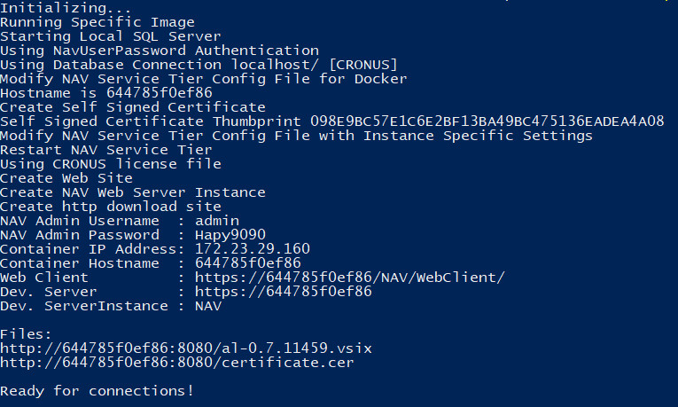

# Examples and use-cases for MS Dynamics NAV on Docker

## BASIC EXAMPLE

This is the most elemental example. I would recommend to run exactly this one at the very first moment to validate that everything is working fine. You have to specify very limited amount of the parameters.

I will explain some of them:
- `--rm` - This is the Docker parameter that will remove automatically the container in case of the failure or in case the container internal lifetime expires. The second case is not expected in case of **nav-docker** containers as the provided images contain a loop. The loop is being executed after the internal services has been configured and executed. The loop is infinite.
- `-m 3G` - Sets the memory limits. Actually, this parameter shouldn\`t be required but we so same problems related with memory and using this parameters we *solved* (of course, this is not the best solution) them. Maybe you can try running the containers without it and give some feedback.
- `-e "Accept_eula=Y"` - Required [environment variable](https://docs.docker.com/engine/reference/run/#env-environment-variables). Practically all `-e` parameters are **nav-docker** related and will affect the behavior of the container. The meaning of `Accept_eula` should be pretty clear - **you accept EULA**. Without accepting EULA the container won\`t start correctly (will fail).

If you fire the script your docker environment will probably need to download the required layers. This will take some time depending on your internet connection, your machine (CPU and HDD performance). If you for example have [microsoft/windowsservercore](https://hub.docker.com/r/microsoft/windowsservercore/) layer already present the required time will be reduced drastically.

After all layers are downloaded the container will be initialized and started. After the container starts up the internal scripts (images scripts) will configure everything needed and all required services will be started.

At the end you should be able to see something like this:

The container provides generated information like:
- NAV user name, NAV user PWD (in this example **NavUserPassword** authentication will be used. 
- Container name (hostname) and its IP.
- Web client link.
- In my case (image with **NAV dev preview**) also link to access from Visual Studio Code.
- Dynamics NAV instance name which is **NAV** by default.
- **VSIX** extension/plugin for Visual Studio Code.
- Certificate (public key) as a self signed certificate has been created to encrypt the communication with NAV services.

### You should write down the data to be able use them later.