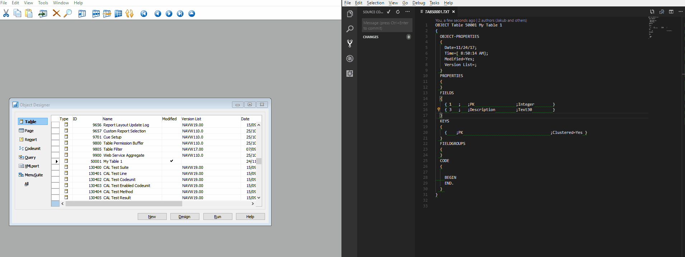

# Examples and use-cases for MS Dynamics NAV on Docker

## SOURCE CONTROL MANAGEMENT (SCM) INTEGRATION (EXPERIMENTAL, WORK-IN-PROGRESS)

**Note:**
    This example is using some prerequisites like: *license*, *repo folder*.

This is an experimental example that will allow you to synchronize object changes to a specified folder (for example Git workspace).

In this example you have to create (if is not present) a folder named `repo` in the same folder the script `run.ps1` is being placed. This will be your repository folder.

When the container is being started it will register some T-SQL scripts that will be used to detect object changes and sync only necessary objects. This approach has some limitations (eg: renaming of the fields are not being detected) so you have another option how to sync fully. You need to remove all files from the `repo` folder. 

The container detects that the folder has no files inside and will run the full export. This actually happens during the container startup phase as well (and again, only if the folder is empty).

I am going to add a simple API into the container to be able run commands inside the container via this HTTP API. This will allow you to run commands like `git2nav`, `full-nav2git` etc. explicitely.

And again, this example will create `RoleTailored Client` folder under `my` folder so you can start working and watch how the changes are being populated (with a tiny delay) in your source control management software (eg: Visual Studio Code).

---

### Any ideas, suggestions or contributions are welcome!!! :)