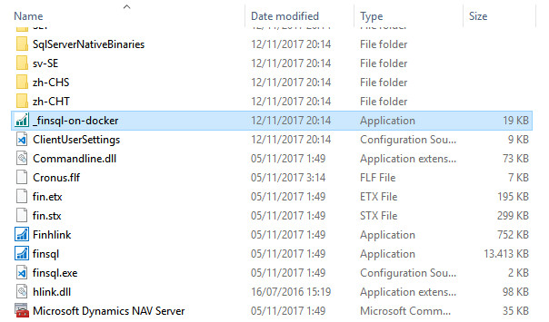
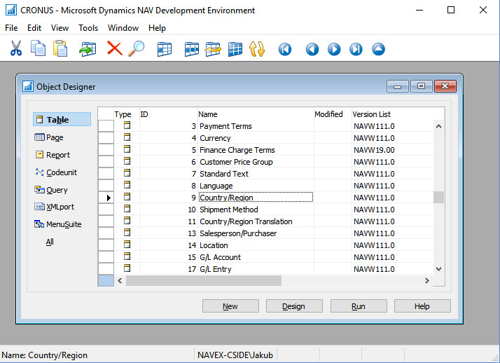

# Examples and use-cases for MS Dynamics NAV on Docker

## COPY C/SIDE TO BE ABLE RUN TABLE SYNCHRONIZATION

This approach aims to solve the problem of the table synchronization in the case you are using *Windows credential mapping hack*. In this particular case you can\`t use *C/SIDE* distributed via *ClickOnce* to sync tables without *gMSA* to achieve schema synchronization.

We will actually copy the content of the *RoleTailored Client* folder back into the host system. Then we will be able to open NAV from the locally provided *C/SIDE* and also sync schema of the tables correctly.

You can ses the next overrides here in this example. There are two standard files being overridden (in the folder `my`):
- `AdditionalSetup.ps1` - This one executes `Export-ClientFolder` function defined in the following file.
- `HelperFunctions.ps1` - You can see I add two new functions here. `Export-ClientFolder` copies the content of *RoleTailored Client* folder down to your *docker host*. It also `ClientUserSettings.config` file properly configured to be able run objects directly from *C/SIDE*. The second function called `New-FinSqlExeRunner` creates an executable that will be copied to the same folder. This new `_runfinsql.exe` file will let you run *C/SIDE* with all required parameters (you won\`t need to configure *C/SIDE* parameters like *server name*, *server instance*, *database name* etc.).


### Specific `docker run` parameters in the example are:

- `-v $PSScriptRoot\my:c:\run\my ` - Required in this example. Specifies the definition of the Docker mount. In this way you activate the override mechanism. In our particular case this will active the code inside `AdditionalSetup.ps1`.

- `-e Auth=Windows` - Required in this example. Was described in the previous examples.

- `-e username=Jakub` - Required in this example. Was described in the previous examples.

- `-e password=$passplain` - Required in this example. Was described in the previous examples.

---

## The output of the `run.ps1` script:


After the container was successfully started you should be able to see one message line in the output:
```
Copy RoleTailoted Client files
```
This one confirms the files were copied down to your *docker host*. Now, you can enter the `my` folder and see the new sub-folder called `RoleTailored Client`:


You can enter the folder and run standard `finsql.exe` or the newly created `_runfinsql.exe` which will run preconfigured `finsql.exe`.





You should be able to run objects directly from the *C/SIDE*:

